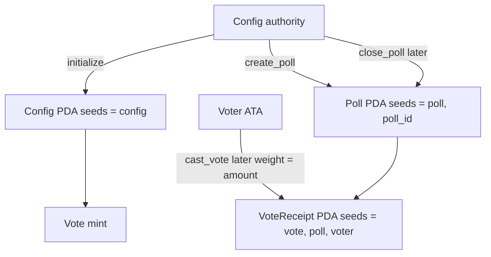

# Ledger Vote

On-chain vote ledger for Solana. Built with [Anchor](https://www.anchor-lang.com/) and tested in-process with [LiteSVM](https://github.com/LiteSVM/litesvm).

Votes are **token-weighted**: weight is the voter’s SPL token balance of a mint stored on `Config`, snapshotted when they vote.

[](LICENSE)
[](https://www.anchor-lang.com/)
[](https://solana.com/)

## What this is

A portfolio Solana program that records polls, votes, and tallies on-chain.

**This PR** adds `create_poll`. Only the Config authority can open a poll. Vote casting is next.

- `initialize` creates `Config` and records the vote mint
- `create_poll` opens a `Poll` PDA at `["poll", poll_id]` where `poll_id = config.poll_count`
- Rejects unauthorized signers, fewer than 2 / more than 4 options, empty question, and invalid time windows
- `VoteReceipt` and `cast_vote` still come later

## Stack

| Tool | Version |
| --- | --- |
| Anchor | 1.1.2 |
| Solana CLI | 3.1.10 |
| Rust (MSRV) | 1.89.0 |
| LiteSVM | 0.10.x |
| solana crates | ^3 |
| Tokens | SPL Token + Token-2022 (`anchor-spl` interfaces) |

## Architecture



| Account | Seeds | Status |
| --- | --- | --- |
| `Config` | `["config"]` | Implemented. Authority, vote mint, sequential `poll_count`. |
| `Poll` | `["poll", poll_id]` | Implemented. Question, 2–4 options, window, tallies. |
| `VoteReceipt` | `["vote", poll, voter]` | Layout only. Choice + snapshotted token weight. |

Vote weight is snapshotted at `cast_vote`. Moving tokens afterward does not change a recorded vote.

## Project layout

```text
.
├── Anchor.toml
├── Cargo.toml
├── programs/ledger-vote/
│   ├── src/
│   │   ├── lib.rs
│   │   ├── constants.rs
│   │   ├── error.rs
│   │   ├── state.rs
│   │   └── instructions/
│   └── tests/
│       ├── common/harness.rs
│       ├── common/poll.rs
│       ├── test_initialize.rs
│       └── test_create_poll.rs
```

## Prerequisites

- Rust 1.89.0 (`rust-toolchain.toml` pins this)
- Solana CLI 3.1.10
- Anchor CLI 1.1.2 (`avm install 1.1.2 && avm use 1.1.2`)

## Build and test

```bash
NO_DNA=1 anchor build
NO_DNA=1 cargo test
```

`anchor test` is wired to `cargo test`. Tests run LiteSVM in-process; no local validator is required.

## Security notes

- Prefer typed `Account<'info, T>` / `InterfaceAccount` over `UncheckedAccount`
- Derive PDAs with canonical seeds and store/verify bumps
- Check signers and `has_one` / `constraint` for authority
- Do not use `init_if_needed` (reinitialization risk)
- Keep program keypairs out of git

## Roadmap

1. Scaffold — workspace, `Config`, LiteSVM
2. Domain accounts + vote mint on `initialize`
3. `create_poll` (this PR)
4. `cast_vote` (token-weighted, one receipt PDA per voter)
5. `close_poll`
6. Minimal web UI (Kit wallet)

## License

MIT. See [LICENSE](LICENSE).
