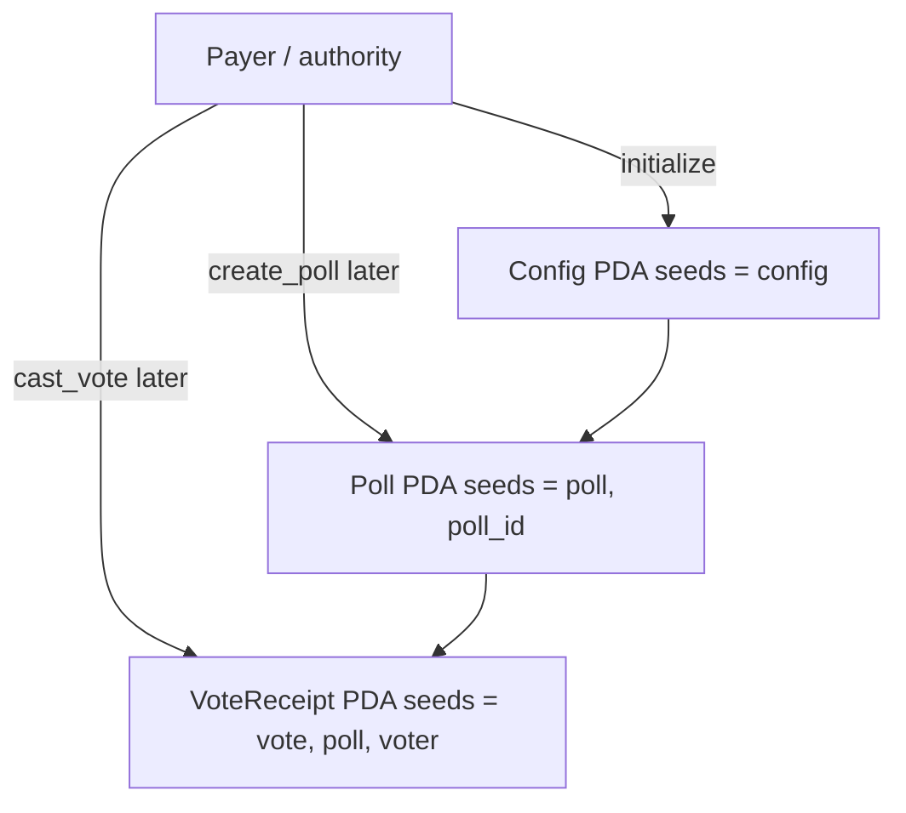

# Ledger Vote

On-chain vote ledger for Solana. Built with [Anchor](https://www.anchor-lang.com/) and tested in-process with [LiteSVM](https://github.com/LiteSVM/litesvm).

[](https://github.com/klisman/ledger-vote-solana/actions/workflows/ci.yml)
[](LICENSE)
[](https://www.anchor-lang.com/)
[](https://solana.com/)

## What this is

A portfolio Solana program that will record polls, votes, and tallies on-chain. This repository currently contains the **workspace scaffold only**:

- Anchor 1.1 workspace and a modular program crate
- A single `initialize` instruction that creates a `Config` PDA
- A LiteSVM smoke test that loads the `.so` and asserts the PDA
- GitHub Actions CI that builds and tests on every pull request

Voting instructions (`create_poll`, `cast_vote`, tally/close) are **not implemented yet**. They will land in follow-up PRs.

## Stack

| Tool | Version |
| --- | --- |
| Anchor | 1.1.2 |
| Solana CLI | 3.1.10 |
| Rust (MSRV) | 1.89.0 |
| LiteSVM | 0.10.x |
| solana crates | ^3 |

## Intended architecture

Design only — `Poll` and `VoteReceipt` are not on-chain yet.



| Account | Seeds | Role |
| --- | --- | --- |
| `Config` | `["config"]` | Program authority. Implemented in this PR. |
| `Poll` | `["poll", poll_id]` | Question, options, window, tallies. Later PR. |
| `VoteReceipt` | `["vote", poll, voter]` | One vote per voter per poll. Later PR. |

## Project layout

```text
.
├── Anchor.toml
├── Cargo.toml
├── programs/ledger-vote/
│   ├── src/
│   │   ├── lib.rs
│   │   ├── constants.rs
│   │   ├── error.rs
│   │   ├── state.rs
│   │   └── instructions/
│   └── tests/test_initialize.rs
└── .github/workflows/ci.yml
```

## Prerequisites

- Rust 1.89.0 (`rust-toolchain.toml` pins this)
- Solana CLI 3.1.10
- Anchor CLI 1.1.2 (`avm install 1.1.2 && avm use 1.1.2`)

## Build and test

```bash
NO_DNA=1 anchor build
NO_DNA=1 cargo test
```

`anchor test` is wired to `cargo test`. Tests run LiteSVM in-process; no local validator is required.

## Security notes

These rules will apply as voting logic is added:

- Prefer typed `Account<'info, T>` over `UncheckedAccount`
- Derive PDAs with canonical seeds and store/verify bumps
- Check signers and `has_one` / `constraint` for authority
- Do not use `init_if_needed` (reinitialization risk)
- Keep program keypairs out of git

## Roadmap

1. Scaffold (this PR) — workspace, `Config`, LiteSVM, CI
2. `Poll` and `VoteReceipt` account layouts
3. `create_poll`
4. `cast_vote` (one receipt PDA per voter)
5. Close / tally and remaining error paths

## License

MIT. See [LICENSE](LICENSE).
