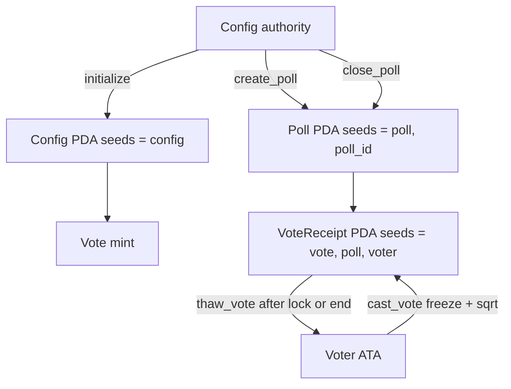

# Ledger Vote

On-chain vote ledger for Solana. Built with [Anchor](https://www.anchor-lang.com/) and tested in-process with [LiteSVM](https://github.com/LiteSVM/litesvm).

Votes are **square-root token-weighted**: weight is `floor(sqrt(ATA amount))` of the mint on `Config`, snapshotted onto `VoteReceipt` when they vote. More tokens still mean more power, but extra balance buys diminishing tally units so a whale cannot linearly dominate a poll.

[](https://github.com/klisman/ledger-vote-solana/actions/workflows/ci.yml)
[](LICENSE)
[](https://www.anchor-lang.com/)
[](https://solana.com/)

## What this is

A portfolio Solana program that records polls, votes, and tallies on-chain, plus a Next.js poll-book UI in `app/`.

- `initialize` creates `Config` and records the vote mint
- `create_poll` opens a `Poll` PDA at `["poll", poll_id]` where `poll_id = config.poll_count`
- `cast_vote` snapshots `weight = floor(sqrt(ATA amount))` onto a `VoteReceipt` and **freezes** the voter ATA (Config PDA is freeze authority)
- `thaw_vote` unfreezes that ATA after the poll is locked or past `end_ts`
- `close_poll` locks the poll (`closed = true`; authority only; rejects a second close)
- Token and Token-2022 ATAs both work (`InterfaceAccount` + `TokenInterface`)
- The web app talks to the program through Kit (no wallet-adapter)

The on-chain program is complete (PRs #2–#6). The UI is the last planned slice ([#7](https://github.com/klisman/ledger-vote-solana/pull/7)).

## Stack

| Tool | Version |
| --- | --- |
| Anchor | 1.1.2 |
| Solana CLI | 3.1.10 |
| Rust (MSRV) | 1.89.0 |
| LiteSVM | 0.10.x |
| solana crates | ^3 |
| Tokens | SPL Token + Token-2022 (`anchor-spl` interfaces) |
| Web | Next.js App Router, `@solana/kit` + `@solana/kit-plugin-wallet` + `@solana/react` |

## Architecture



| Account | Seeds | Status |
| --- | --- | --- |
| `Config` | `["config"]` | Implemented. Authority, vote mint, sequential `poll_count`. |
| `Poll` | `["poll", poll_id]` | Implemented. Question, 2–4 options, window, tallies, `closed`. |
| `VoteReceipt` | `["vote", poll, voter]` | Implemented. Choice + `floor(sqrt(ATA amount))` snapshotted at vote. One per voter per poll. |

## Instructions

| Instruction | Signer | Effect |
| --- | --- | --- |
| `initialize` | payer (becomes Config authority) | Creates `Config`, stores `vote_mint`. Rejects unless freeze authority is this Config PDA and `token_program` owns the mint |
| `create_poll` | Config authority | Creates the next `Poll` PDA, increments `poll_count` |
| `cast_vote` | any wallet with a positive vote-mint ATA | Snapshots `floor(sqrt(amount))`, freezes the ATA so the same pile cannot be transferred and voted again |
| `thaw_vote` | the voter, after lock or `end_ts` | Thaws the ATA. Tokens can move again. |
| `close_poll` | Config authority | Locks the poll (`closed = true`). Does not change tallies or reclaim rent. May run before `end_ts` |

## Vote weight

Weight is still derived from the vote-mint ATA, but it is **not linear**. `cast_vote` writes:

```text
weight = floor(sqrt(raw_ata_amount))
```

`raw_ata_amount` is the token account’s `amount` field (base units, not UI tokens). A 6-decimal mint with 1 whole token is `1_000_000` raw units → weight `1000`.

| Raw ATA amount | Linear `amount` | This program `floor(sqrt(amount))` |
| --- | ---: | ---: |
| 1 | 1 | 1 |
| 100 | 100 | 10 |
| 1,000,000 | 1,000,000 | 1,000 |
| 1,000,000,000,000 | 1,000,000,000,000 | 1,000,000 |

A whale with 1,000,000 raw units has **1,000×** a holder with 1 unit, not 1,000,000×. Extra tokens still help, but each doubling of balance adds less voting power than linear weighting.

| Rule | Value |
| --- | --- |
| Who can vote | Signer whose canonical ATA of `Config.vote_mint` has `amount > 0` |
| Weight written to `VoteReceipt` | `floor(sqrt(amount))` (`vote_weight` in `weight.rs`) |
| When it is frozen | At `cast_vote`. The Config PDA is freeze authority, so that ATA cannot transfer until `thaw_vote`. |
| One snapshot per wallet | `VoteReceipt` PDA `["vote", poll, voter]` is `init` — a second vote from the same wallet fails |

`Poll.tallies[i]` is the **sum of square-root weights** for wallets that chose option `i`.

Weight is per **wallet snapshot**, not per token. Sequential reuse (transfer the full pile to wallet 2 and vote again) is blocked because `cast_vote` freezes the ATA. Freeze authority must be the Config PDA. Thaw after the poll is locked or ended. Splitting into many tiny balances *before* voting is still possible (100 wallets of 1 → 100, vs one wallet of 100 → 10). That still needs SOL, an ATA, and a signature per wallet.

**Overlapping polls.** Freeze is per ATA, not per poll. Voting in poll A freezes the account; a second open poll B can still be voted from that same frozen ATA. Thawing after A ends would unfreeze while B is still open. The UI hides thaw until no other poll is open. The instruction itself does not scan other polls (no remaining-accounts loop). Treat concurrent open polls as a clerk-desk limitation, not escrow.

`Config` is a first-writer singleton on this program id: whoever lands `initialize` is authority for every poll. Keep mint authority only if you want a faucet; revoke it after distribution. The UI mint button exists only **before** initialize.

`close_poll` **locks** the poll (`closed = true`). It does not reclaim rent.

## Project layout

```text
.
├── Anchor.toml
├── Cargo.toml
├── programs/ledger-vote/
│   ├── src/
│   │   ├── lib.rs
│   │   ├── constants.rs
│   │   ├── error.rs
│   │   ├── state.rs
│   │   ├── weight.rs
│   │   └── instructions/
│   └── tests/
│       ├── common/harness.rs
│       ├── common/poll.rs
│       ├── common/vote.rs
│       ├── common/close.rs
│       ├── test_initialize.rs
│       ├── test_create_poll.rs
│       ├── test_cast_vote.rs
│       ├── test_close_poll.rs
│       └── test_thaw_vote.rs
├── .github/workflows/ci.yml
└── app/                          # Next.js poll-book UI
    ├── src/app/
    ├── src/components/
    ├── src/lib/
    └── src/idl/ledger_vote.json  # committed copy; target/ stays gitignored
```

## Prerequisites

- Rust 1.89.0 (`rust-toolchain.toml` pins this)
- Solana CLI 3.1.10
- Anchor CLI 1.1.2 (`avm install 1.1.2 && avm use 1.1.2`)
- Node.js 24+ (for `app/`; Kit token packages require it)

## Build and test

```bash
NO_DNA=1 anchor build
NO_DNA=1 cargo test
```

`anchor test` is wired to `cargo test`. Tests run LiteSVM in-process; no local validator is required. GitHub Actions runs the same program job plus `cd app && npm test` and `tsc --noEmit`.

## Web UI

Minimal Next.js app in [`app/`](app/). Default cluster is **localnet**. There is no indexer: the poll list is `0 .. config.poll_count` with PDAs derived in the client. A committed IDL copy lives at `app/src/idl/ledger_vote.json`. Instruction codecs are hand-rolled from that IDL (no Codama client).

```bash
cd app
cp .env.example .env.local   # optional; defaults are already localnet
npm install
npm run dev
```

Open [http://localhost:3000](http://localhost:3000). Connect a Wallet Standard wallet (Phantom / Solflare) set to the same cluster as `NEXT_PUBLIC_SOLANA_CLUSTER`.

| Env | Default | Purpose |
| --- | --- | --- |
| `NEXT_PUBLIC_SOLANA_CLUSTER` | `localnet` | `localnet` or `devnet` (sets the wallet chain) |
| `NEXT_PUBLIC_SOLANA_RPC_URL` | `http://127.0.0.1:8899` | JSON-RPC |
| `NEXT_PUBLIC_PROGRAM_ID` | `5VQzLw5d2hJeTUVBhWqDGoUSy8neABguNHTBgrJFUper` | Program id in source |

The program must be **deployed at that id** on the cluster. LiteSVM tests do not put it on a validator. For localnet:

```bash
solana-test-validator --reset --bpf-program 5VQzLw5d2hJeTUVBhWqDGoUSy8neABguNHTBgrJFUper target/deploy/ledger_vote.so
```

Do not `anchor keys sync`.

**First-time Config.** On the page, **Create mint & fund this wallet** (6 decimals, freeze authority = Config PDA, mint authority = connected wallet). That fills **Vote mint**; then initialize. Revoke mint authority after you have funded voters. The CLI still works if you set freeze to the Config PDA:

```bash
spl-token create-token --decimals 6
spl-token authorize <MINT> freeze <CONFIG_PDA>
spl-token create-account <MINT>
spl-token mint <MINT> 100
```

**Mint to this wallet** only works when the connected wallet is the mint authority. A mint created with the CLI is owned by `id.json`, so Phantom cannot mint it from the page. Authority can then create and lock polls. Anyone with a positive canonical ATA of that mint can vote once per poll. The brass seal shows `floor(sqrt(raw ATA amount))` before you sign.

```bash
cd app && npm test    # codec / weight unit tests
```

## Security notes

- Prefer typed `Account<'info, T>` / `InterfaceAccount` over `UncheckedAccount`
- Derive PDAs with canonical seeds and store/verify bumps
- Check signers and `has_one` / `constraint` for authority (`create_poll`, `close_poll`)
- Constrain the voter ATA to `config.vote_mint` (`associated_token`)
- Do not use `init_if_needed` (reinitialization risk); one `VoteReceipt` per voter is `init`
- Keep program keypairs out of git

## Roadmap

Sequential PRs. Each is its own branch; merge before starting the next.

| # | Work | Branch | Status |
| --- | --- | --- | --- |
| 1 | Scaffold — workspace, `Config`, LiteSVM | `feat/01-scaffold` | Merged ([#2](https://github.com/klisman/ledger-vote-solana/pull/2)) |
| 2 | Domain accounts + vote mint on `initialize` | `feat/02-accounts-and-mint` | Merged ([#3](https://github.com/klisman/ledger-vote-solana/pull/3)) |
| 3 | `create_poll` | `feat/03-create-poll` | Merged ([#4](https://github.com/klisman/ledger-vote-solana/pull/4)) |
| 4 | `cast_vote` — square-root token weight, one `VoteReceipt` per voter | `feat/04-cast-vote` | Merged ([#5](https://github.com/klisman/ledger-vote-solana/pull/5)) |
| 5 | `close_poll` — authority locks the poll; later votes fail | `feat/05-close-poll` | Merged ([#6](https://github.com/klisman/ledger-vote-solana/pull/6)) |
| 6 | Web UI — Next.js + Kit wallet, in-page mint to the connected wallet | `feat/06-web-ui` | Open ([#7](https://github.com/klisman/ledger-vote-solana/pull/7)) |

After #7 merges, the planned product is done. Folded into that PR: freeze-on-vote, localnet-first defaults, Kit log unwrapping, GitHub Actions (`NO_DNA=1 anchor build` + `cargo test` + `app` unit tests). Optional later: screenshot, Codama client. Not planned: Surfpool, mainnet, changing votes, withdrawing receipt rent, escrow vaults.

`cast_vote` weight is `floor(sqrt(raw ATA amount))`, snapshotted on the receipt. Linear `weight = amount` is out: extra tokens still add power, with diminishing returns so a whale cannot linearly dominate.

## License

MIT. See [LICENSE](LICENSE).
